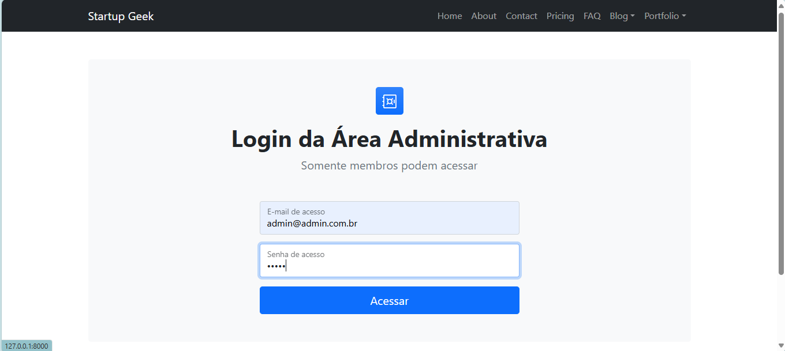
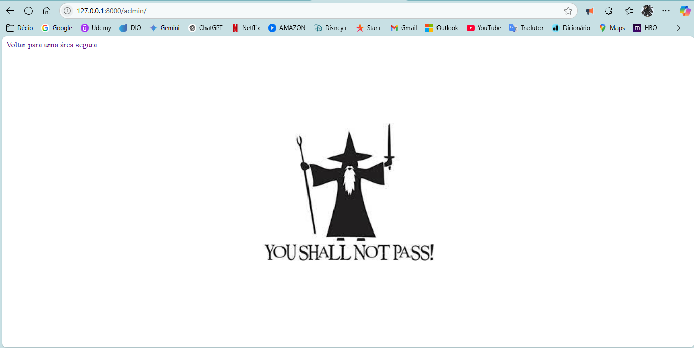
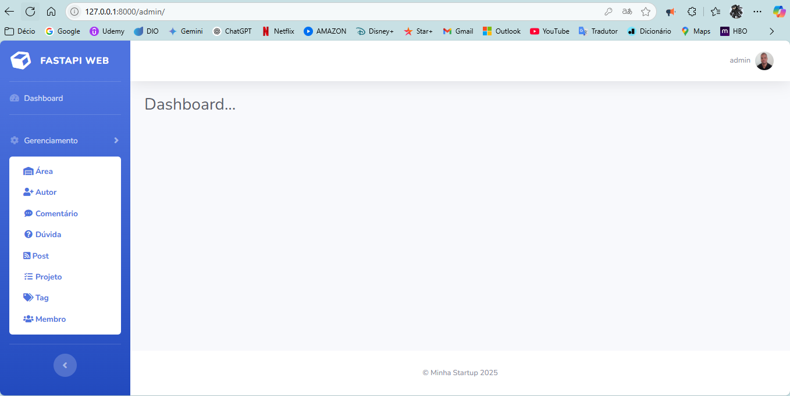
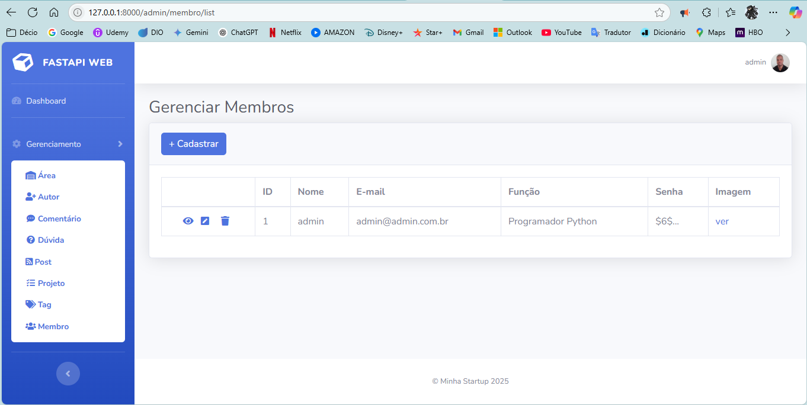

# PROJETO_WEBSITE_COM_FASTAPI

- Projeto FULLSTACK construção de WEBSITE com FastAPI e conexão em Banco de Dados.

- Este projeto consiste em aplicação das tecnologias FastAPI, SQLAlchemy e Jinja2. Para manipulação de paginas HTML e Banco de Dados, utilizando as linguagens de programação Python e JavaScript.

- O projeto consiste em duas áreas distintas de navegação paginas (publicas) de acesso comum de usuários e paginas (privadas) para área administrativa de acesso restrito a membros cadastrado.

- Paginas de navegação:
    - http://127.0.0.1:8000/  (publico)
    - http://127.0.0.1:8000/admin  (privado)

- Para acesso a pagina administrativa é necessário login de um membro previamente cadastrado na URL: http://127.0.0.1:8000/login

- O acesso ao login fica no roda pé de qualquer pagina de acesso ao publico em geral (publicas):

- Para primeiro acesso ao login utilize o membro pré-cadastrado "admin":
    - E-mail de acesso: admin@admin.com.br
    - Senha de acesso: admin

- As URL das paginas administrativa estão protegidas por autenticação criptografada por "hash" de algoritmo SHA-512, impossibilitando o uso de usuário mau intencionado o acesso direto nas paginas administrativa sem login.

- Apos login o usuário terá acesso a todos os serviços da área administrativa, podendo visualizar, criar, editar e deletar, qualquer serviço disponível nas paginas com exceção ao membro "admin".

- Observação: O membro "admin" não pode ser alterado ou deletado, todos os outros membros criados posteriormente podem. Essa limitação ao usuário é imposta para garantir o acesso a aplicação uma vem que somente membros previamente cadastrados podem ter acesso a área administrativa.

## __Convido a você testar a aplicação!__

